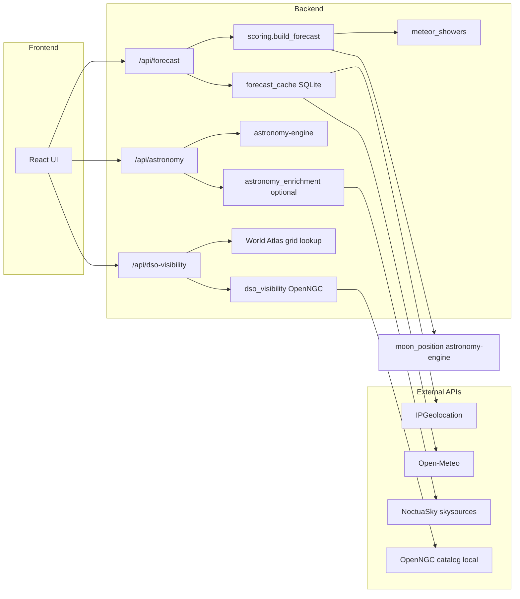

# Finderscope

A full-stack web app for stargazers. Enter an address to get a 7-day stargazing weather forecast, meteor shower peak highlights on matching nights, and a local astronomy summary (90-day events, planet visibility timelines, and a ranked deep sky top 10) for your location.

## Application functionality

### Forecast search

1. The user enters a street address or place name.
2. The backend geocodes the location and fetches seven nights of astronomical darkness windows, moon data, and weather at hourly and 15-minutely resolution.
3. The UI displays one **night card** per evening, each with an overall stargazing score, rating, moon details, cloud/precipitation summaries, suggested best hours, and **meteor shower peak badges** when a major shower peaks that night and its radiant is observable during astronomical darkness at the location.
4. Selecting a night opens a **scores panel** with half-hour (or hourly) bars during darkness, weather metrics, a dew point curve, and per-interval moon sky glow and altitude rows.

Before the first forecast search, the landing page shows **NASA’s Astronomy Picture of the Day** (APOD) in a panel below the search bar. The image scales to the viewport; title, credit/copyright, explanation, and NASA API attribution are included. The panel disappears once a forecast loads. APOD “today” follows NASA’s **04:00 UTC** publish time (not midnight UTC). A full-screen **animated sky scene** (Milky Way band, stars, moon, occasional meteors) sits behind the UI.

The search header includes an **Imperial / Metric** toggle (persisted in `localStorage`). It converts **display only** for temperature (°F/°C), visibility (mi/km), and precipitation (in/mm) on night cards, the hourly panel, dew chart labels, and precip summaries. Scores, percentages, moon altitude, seeing/transparency bins, and astronomy data are unchanged; API and scoring still use Open-Meteo’s stored units (°F, meters, mm).

A fixed **Panel opacity** control (bottom-right, persisted as `finderscope:panel-blur` in `localStorage`) toggles frosted panel blur on or off. **On** (default) keeps semi-transparent panels with `backdrop-filter` so the sky shows through softly; **Off** removes panel blur for smoother scrolling in Chromium on Windows at the cost of a flatter look. APOD and the half-hourly scores panel use fully opaque fills when blur is off so text and charts stay readable. Click anywhere on the control to switch states.

The scores panel uses a **unified left-aligned grid**: each row pairs a sticky label column with a data column so time labels, score bars, dew/air temperature lines, and metric values stay vertically aligned. Score values appear at the bottom of each bar; the dew point chart plots dew point and air temperature on a shared scale with padded Y-axis headroom. When `score_step_minutes` is `30`, columns are narrower and time labels are thinned to keep the panel readable. The chart scrolls horizontally inside the panel when needed; document and in-panel scrollbars use a thin themed style and appear only when content overflows. The **Moon glow** row shows **Down** when the moon is below the horizon (instead of a longer label) to keep column alignment.

### Stargazing score

Each score interval during astronomical darkness receives a score from 0–100 based on:

| Factor | Weight | Source |
|--------|--------|--------|
| Cloud cover | 40% | Open-Meteo (15-min preferred, hourly fallback) |
| Visibility | 25% | Open-Meteo (15-min preferred, hourly fallback) |
| Moon sky glow | 25% | IPGeolocation phase + astronomy-engine altitude |
| Precipitation / weather code | 10% | Open-Meteo (15-min preferred, hourly fallback) |

**7timer astro display:** When enabled, [7timer ASTRO](https://www.7timer.info/doc.php?lang=en) supplies categorical **seeing** (arcsecond stability) and **atmospheric transparency** (mag/airmass extinction) for display on night cards and the hourly panel during its ~72-hour window (typically the first ~3 forecast days). These metrics are informational only — they do not affect the stargazing score. Nights beyond that window set `astro_forecast_limited: true` and show visibility only for sky clarity. Seeing bin labels use **arcseconds** (″); a short note above the forecast grid clarifies this. If 7timer is enabled but the upstream request fails (empty JSON, HTTP error, timeout), the forecast **fail-opens**: the API still returns 200 with visibility-only astro display, `astro_data_unavailable: true`, and a notice below the reliability disclaimer. Invalid 7timer responses are not cached.

**Score step:** The API returns `score_step_minutes: 30` when half-hour slots are built. Each night’s darkness window can start at times like `21:30`; half-hour steps align scores with those boundaries instead of rounding to the next full hour.

| Resolution | Weather source | `:00` slots | `:30` slots |
|------------|----------------|-------------|-------------|
| Preferred | Open-Meteo `minutely_15` at `:00` / `:30` | Direct sample | Direct sample; precipitation sums two 15-min buckets |
| Fallback | Open-Meteo `hourly` | Hourly value | Linear interpolation of continuous fields; precipitation uses half the enclosing hour’s total |

The nightly card score is the average of interval scores during darkness. **Best hours** are contiguous windows where interval scores reach 70 or higher (may start or end at `:30`).

Moon impact uses two related concepts:

| Term | Meaning |
|------|---------|
| **Disk lit** | Lunar phase illumination — how much of the moon's disk is illuminated that night |
| **Avg moon sky glow** | Average effective sky brightness from moonlight during darkness; drives the nightly score |
| **Effective moon sky glow** (per interval) | Phase illumination scaled by moon altitude via `sin(altitude)`; low or below-horizon moons contribute less |

Moonrise and moonset on night cards are informational. Interval scores compute moon altitude with astronomy-engine at each slot’s midpoint (+15 minutes for 30-min steps).

### Moon enrichment (FreeAstroAPI)

Night cards optionally show richer lunar display data and SVG phase graphics from [FreeAstroAPI](https://www.freeastroapi.com/moon). This is **UI-only enrichment** — forecast scores still use IPGeolocation disk illumination and astronomy-engine altitude.

| Step | Behavior |
|------|----------|
| Forecast search | Returns immediately with IPGeolocation moon text (0 FreeAstro calls) |
| Moon enrichment | Frontend calls `GET /api/moon/enrichment` after forecast loads |
| Cache hit | Phase name, age, special labels, and SVG served from server cache (0 live calls) |
| Cache miss | Backend queues fetches at **1 req/sec**; UI polls until graphics appear |
| Quota exhausted | Falls back to placeholder moon + IPGeolocation labels |

Free tier limits: **80 calls/day**, **1 request/second**. The server caches phase data globally by calendar date (shared across all users). A daily prewarm script fetches the next 7 dates (~7 calls/day) so most searches never hit the live API.

Moon enrichment routes are gated by `MOON_ENRICHMENT_ENABLED=true` (default) **and** a non-empty `FREEASTRO_API_KEY`. When disabled or unconfigured, the UI falls back to IPGeolocation moon labels and placeholder graphics.

```bash
./scripts/prewarm-moon-cache.sh   # optional; requires FREEASTRO_API_KEY in backend/.env
```

### Astronomy summary (astronomy-engine)

After a forecast loads, the frontend calls `POST /api/astronomy` in parallel with moon enrichment. The backend uses [astronomy-engine](https://pypi.org/project/astronomy-engine/) locally — no API key required.

| Section | Window | Content |
|---------|--------|---------|
| **Events timeline** | Next 3 months | Lunar eclipses, local solar eclipses, Mercury/Venus transits, planetary oppositions/conjunctions, bright planet–planet conjunctions (≤ ~3° separation), and major meteor shower peaks (local IAU catalog + radiant/darkness checks) |
| **Planet visibility** | 7 forecast nights | For each calendar night date, whether Mercury–Neptune is above the horizon at any time that day |
| **Deep sky visibility** | 7 forecast nights | Top 10 OpenNGC objects ranked by contrast under local light pollution and moon sky glow; astronomical twilight only |

Planet visibility rows include **sun-aware observing windows** when the planet is above the horizon and the Sun is below civil twilight (−6°) or astronomical twilight (−18°): `windows_civil[]` and `windows_astronomical[]` (local `HH:MM`), plus **peak altitude**, **peak time**, and **magnitude** at peak. Uranus and Neptune appear as muted telescope rows. The UI shows a **24-hour timeline** for the selected forecast night with lighter civil-twilight bars, solid astronomical bars, and a **forecast darkness overlay** clipped to that calendar day; a date dropdown switches among the seven forecast nights.

After astronomy data loads, the frontend calls `POST /api/dso-visibility`. The **Deep sky visibility** section shows a **6 PM–6 AM** timeline (one bar per object during `windows_astronomical[]`), a site-sky chip (Bortle, SQM, limiting magnitude), and a details table. DSO ranking uses contrast against local sky brightness and moon penalty at each object’s peak time; civil twilight is excluded because residual sky glow is too bright for faint DSOs.

Events show a local visibility badge when they are global phenomena not guaranteed to be visible at the forecast location (e.g. transits, inferior/superior conjunctions with the Sun).

**Optional NoctuaSky enrichment** (`NOCTUA_ENRICHMENT_ENABLED=true`): after local event discovery, the server attaches catalog metadata (`subjects[]`: types, aliases, interest score) from [NoctuaSky](https://api.noctuasky.com/api/v1/swaggerdoc/) `skysources` for resolvable bodies. Enrichment is fail-open (events return without `subjects[]` on timeout). Event cards show raw type codes (e.g. **Pla** = planet, **SSO** = solar system object) and an **Interest** score from the Noctua catalog. See `backend/docs/noctua_skysources.md`.

### Forecast response cache

`POST /api/forecast` caches upstream responses in SQLite (`backend/data/forecast_cache/`) when `FORECAST_CACHE_ENABLED=true` (default):

| Layer | Key | TTL (default) |
|-------|-----|---------------|
| Geocode | normalized address hash | 30 days |
| IPGeolocation astronomy time series | lat/lon (4 dp) + date range | 24 h |
| Open-Meteo weather | lat/lon (4 dp) + forecast start + days | 3 h |
| 7timer ASTRO | lat/lon (4 dp) | 3 h |

Cached raw weather and astronomy payloads are re-scored on each request so scoring logic changes apply without invalidating weather data.

Night forecast cards show **meteor shower peak badges** when the catalog peak date matches a forecast night and the radiant is above the horizon during that night's astronomical darkness at the location.

### External services

| Service | Role | API key |
|---------|------|---------|
| [IPGeolocation.io](https://ipgeolocation.io) | Geocoding, twilight windows, moon phase/times | Required |
| [Open-Meteo](https://open-meteo.com) | Hourly, 15-minutely, and daily weather; visibility for scoring | None |
| [7timer ASTRO](https://www.7timer.info/doc.php?lang=en) | Astronomical seeing and atmospheric transparency for display (~3-day window) | None |
| [NASA APOD](https://api.nasa.gov/) | Astronomy Picture of the Day on the landing page | Optional (`DEMO_KEY` default) |
| [FreeAstroAPI](https://www.freeastroapi.com/moon) | Moon phase graphics and enriched lunar labels (optional) | Optional |
| [astronomy-engine](https://pypi.org/project/astronomy-engine/) | Local eclipse, conjunction, meteor shower, and planet visibility calculations | None (MIT library) |
| [NoctuaSky](https://api.noctuasky.com/api/v1/swaggerdoc/) | Optional catalog metadata enrichment for astronomy events | None (public skysources) |
| [OpenNGC](https://github.com/mattiaverga/OpenNGC) | Deep sky object catalog (NGC.csv) for DSO visibility | None (CC-BY-SA-4.0 data) |
| [Falchi et al. 2016 World Atlas](https://doi.org/10.5880/GFZ.1.4.2016.001) | Site SQM / Bortle for DSO contrast scoring (bundled 0.1° grid) | None (CC BY-NC 4.0 data) |

API keys live in `backend/.env` only; the frontend never sees them.

The shared outbound HTTP client honors `HTTP_TRUST_ENV` (default `true`). Set `HTTP_TRUST_ENV=false` in `backend/.env` when local system proxy environment variables cause outbound API failures during development.

## File architecture

```
finderscope/
├── backend/                    # FastAPI server
│   ├── app/
│   │   ├── main.py             # App entry, CORS, lifespan HTTP client, /health
│   │   ├── config.py           # Settings from environment (.env)
│   │   ├── models/
│   │   │   ├── forecast.py     # Pydantic schemas for forecast API
│   │   │   ├── moon_enrichment.py  # Pydantic schemas for moon enrichment API
│   │   │   ├── astronomy.py    # Pydantic schemas for astronomy summary API
│   │   │   ├── dso_visibility.py  # Pydantic schemas for DSO visibility API
│   │   │   └── apod.py         # Pydantic schemas for NASA APOD proxy
│   │   ├── routers/
│   │   │   ├── forecast.py     # POST /api/forecast orchestration
│   │   │   ├── moon_enrichment.py  # GET /api/moon/enrichment + SVG route
│   │   │   ├── astronomy.py    # POST /api/astronomy
│   │   │   ├── dso_visibility.py  # POST /api/dso-visibility
│   │   │   └── apod.py         # GET /api/apod
│   │   └── services/
│   │       ├── ipgeolocation.py    # Astronomy API client (geocode + time series)
│   │       ├── openmeteo.py        # Weather forecast client
│   │       ├── seventimer.py       # 7timer ASTRO seeing/transparency client
│   │       ├── nasa_apod.py        # NASA APOD client + daily cache
│   │       ├── http_client.py      # Shared httpx AsyncClient (HTTP_TRUST_ENV)
│   │       ├── scoring.py          # Merge weather + astronomy into scores
│   │       ├── moon_position.py    # astronomy-engine moon altitude + sky-glow curve
│   │       ├── astronomy_geometry.py  # Shared darkness-window and altitude helpers
│   │       ├── astronomy_events.py # 90-day eclipse/conjunction event search
│   │       ├── planet_visibility.py  # Sun-aware planet observing windows (civil / astronomical)
│   │       ├── visibility_windows.py  # Shared twilight window helpers
│   │       ├── dso_visibility.py   # OpenNGC ranking + DSO timeline windows (astro only)
│   │       ├── openngc_catalog.py  # OpenNGC CSV loader
│   │       ├── light_pollution.py  # Site SQM / Bortle lookup
│   │       ├── astronomy_time.py   # Timezone/time helpers for astronomy-engine
│   │       ├── freeastroapi.py     # FreeAstro moon phase client
│   │       ├── moon_cache.py       # SQLite + SVG cache for moon enrichment
│   │       ├── moon_enrichment.py  # Enrichment orchestration
│   │       ├── moon_enrichment_queue.py  # 1 RPS rate-limited fetch queue
│   │       ├── forecast_cache.py   # SQLite cache for geocode / astronomy / weather
│   │       ├── meteor_showers.py   # IAU catalog + radiant visibility for forecast highlights
│   │       ├── noctua.py           # NoctuaSky skysources client
│   │       ├── noctua_cache.py     # Permanent skysource catalog cache
│   │       └── astronomy_enrichment.py  # Category-aware Noctua enrichment
│   ├── docs/
│   │   ├── noctua_skysources.md    # NoctuaSky enrichment design notes
│   │   ├── performance-baseline.md # Hot-path benchmark guide
│   │   └── performance-deferred.md # Deferred optimizations (Phase 3)
│   ├── data/iau_meteor_showers.json  # Major shower peaks (local catalog)
│   ├── data/openngc/           # OpenNGC NGC.csv (download via scripts/fetch_openngc.py)
│   ├── data/light_pollution/   # World Atlas 2015 grid (world_atlas_grid.json, CC BY-NC 4.0)
│   ├── scripts/fetch_openngc.py
│   ├── scripts/build_light_pollution_grid.py  # Regenerate grid from GFZ GeoTIFF (dev only)
│   ├── data/forecast_cache/    # Forecast upstream cache (gitignored)
│   ├── data/moon_cache/        # Cached FreeAstro moon SVGs + quota state (gitignored)
│   ├── data/noctua_cache/      # Cached Noctua skysource responses (gitignored)
│   ├── tests/
│   │   ├── test_dso_visibility.py
│   │   ├── test_dso_visibility_routes.py
│   │   ├── test_openngc_catalog.py
│   │   ├── test_light_pollution.py
│   │   ├── test_scoring.py     # Scoring and forecast assembly tests
│   │   ├── test_moon_position.py
│   │   ├── test_astronomy_events.py
│   │   ├── test_planet_visibility.py
│   │   ├── test_astronomy_routes.py
│   │   ├── test_forecast_cache.py
│   │   ├── test_astronomy_enrichment.py
│   │   ├── test_meteor_showers.py
│   │   ├── test_moon_enrichment_routes.py
│   │   ├── test_moon_cache.py
│   │   ├── test_freeastroapi.py
│   │   ├── test_performance_benchmarks.py  # Hot-path timing regression guards
│   │   ├── test_seventimer.py
│   │   ├── test_agent_pr_review.py  # PR agent review findings parser tests
│   │   ├── test_nasa_apod.py
│   │   ├── test_routes.py      # Route tests with mocked services
│   │   ├── test_integration_live.py  # Opt-in live API tests
│   │   └── fixtures/           # JSON fixtures + E2E fixture generator
│   ├── requirements.txt
│   ├── requirements-dev.txt
│   └── ruff.toml               # Backend lint config (ruff check in integrity harness)
│
├── frontend/                   # React + Vite SPA
│   ├── src/
│   │   ├── App.tsx             # Main layout and state wiring
│   │   ├── main.tsx            # React entry point
│   │   ├── styles/             # Modular global CSS (imported via index.css)
│   │   │   ├── index.css       # Aggregates partial stylesheets
│   │   │   ├── base.css
│   │   │   ├── scrollbars.css      # Themed document + in-panel scrollbars
│   │   │   ├── night-cards.css
│   │   │   ├── hourly-chart.css
│   │   │   ├── weather-breakdown.css
│   │   │   ├── astronomy.css
│   │   │   ├── planet-timeline.css
│   │   │   ├── responsive.css
│   │   │   ├── apod.css
│   │   │   ├── sky-scene.css
│   │   │   └── error.css
│   │   ├── components/
│   │   │   ├── AddressSearch.tsx
│   │   │   ├── ApodPanel.tsx           # Landing-page NASA APOD
│   │   │   ├── SkyScene.tsx            # Animated background sky layer
│   │   │   ├── UnitToggle.tsx          # Imperial / Metric segmented control
│   │   │   ├── PanelBlurToggle.tsx     # Fixed panel opacity (blur on/off) control
│   │   │   ├── NightForecastCard.tsx   # Daily night summary cards
│   │   │   ├── HourlyScoreChart.tsx    # Unified grid: scores, dew/temp, metrics
│   │   │   ├── hourly-chart-layout.ts  # Shared column width and temperature scale helpers
│   │   │   ├── AstronomyEventsPanel.tsx  # Events, planet visibility, deep sky top 10
│   │   │   ├── PlanetVisibilityTimeline.tsx  # 24h planet bars with darkness overlay
│   │   │   ├── DsoVisibilityTimeline.tsx   # 6 PM–6 AM deep sky bars
│   │   │   ├── CloudBreakdown.tsx
│   │   │   ├── PrecipitationBreakdownView.tsx
│   │   │   ├── DewPointChart.tsx
│   │   │   └── ErrorBanner.tsx
│   │   ├── context/
│   │   │   ├── UnitPreferenceContext.tsx  # Unit system preference + localStorage
│   │   │   └── PanelBlurPreferenceContext.tsx  # Panel blur preference + localStorage
│   │   ├── hooks/
│   │   │   ├── useForecast.ts  # Forecast fetch state
│   │   │   ├── useApod.ts      # Landing-page APOD fetch
│   │   │   ├── useWeatherFormat.ts  # Unit-aware weather formatters
│   │   │   ├── useMoonEnrichment.ts  # Async FreeAstro moon graphics
│   │   │   ├── useAstronomySummary.ts  # Astronomy summary fetch state
│   │   │   └── useDsoVisibility.ts     # Deep sky visibility fetch after astronomy
│   │   ├── lib/
│   │   │   ├── backend-client.ts   # Typed fetch wrappers for /api
│   │   │   ├── astronomy-format.ts # Astronomy panel display formatters
│   │   │   ├── apod-format.ts      # APOD explanation cleanup
│   │   │   ├── planet-timeline-layout.ts # 24h timeline segment helpers
│   │   │   ├── dso-timeline-layout.ts    # 6 PM–6 AM DSO timeline helpers
│   │   │   ├── moon-sample-time.ts # Dark-window sample times for moon enrichment
│   │   │   ├── unit-system.ts      # Imperial/metric conversion helpers
│   │   │   ├── panel-blur-preference.ts  # Panel blur localStorage helpers
│   │   │   ├── skyScene.ts         # Sky animation (stars, Milky Way, meteors)
│   │   │   └── weather-format.ts   # Display formatters + createWeatherFormatters()
│   │   └── types/
│   │       ├── forecast.ts
│   │       ├── apod.ts
│   │       ├── moon-enrichment.ts
│   │       ├── dso-visibility.ts
│   │       └── astronomy.ts
│   └── vite.config.ts          # Dev server; proxies /api → localhost:8000
│
├── e2e/                        # Playwright browser tests
│   ├── tests/
│   │   ├── app.spec.ts              # Forecast, astronomy, deep sky visibility
│   │   ├── visual-baseline.spec.ts  # CSS regression snapshots
│   │   └── helpers/
│   │       └── mock-api.ts           # Browser-side /api/* mocks
│   └── fixtures/               # Mocked API responses for offline E2E
│
├── scripts/
│   ├── check-integrity.sh      # Full test/lint/build harness
│   ├── agent_pr_review.py      # PR agent review (Cursor SDK)
│   ├── agent_pr_review_requirements.txt
│   ├── stop-dev-servers.sh     # Stop uvicorn (8000) and Vite (5173)
│   ├── stop-dev-servers.ps1    # Windows equivalent of stop-dev-servers.sh
│   ├── prewarm-moon-cache.sh   # Daily FreeAstro cache prewarm (7 calls)
│   ├── prewarm_moon_cache.py   # Prewarm implementation (called by shell script)
│   └── record-e2e-fixtures.sh  # Refresh E2E fixtures from live APIs
│
├── docs/
│   ├── CODE_REVIEW.md          # Local + PR code review setup, modes, rollback
│   └── DEPLOYMENT.md           # Production deployment guide
├── AGENTS.md                   # Cursor agent pointer (run code-review before PR)
│
├── .github/workflows/ci.yml    # Runs check-integrity.sh on push/PR
├── .github/workflows/agent-review.yml  # PR agent review (optional CURSOR_API_KEY)
├── .github/workflows/moon-prewarm.yml  # Scheduled moon cache prewarm
└── .cursor/skills/             # Agent skills for local development
    ├── dev-setup/              # Install deps and configure backend/.env
    ├── run-dev/                # Stop stale servers and start uvicorn + Vite
    ├── integrity-check/        # Run the full integrity harness
    └── code-review/            # Pre-merge review orchestration
```

### Request flow



## Prerequisites

- Python 3.10+
- Node.js 18+
- Free API key from [IPGeolocation.io](https://ipgeolocation.io)
- Optional [FreeAstroAPI](https://www.freeastroapi.com/moon) key for moon phase SVG enrichment
- [OpenNGC](https://github.com/mattiaverga/OpenNGC) catalog file for deep sky visibility (one-time download; see Backend setup)

Open-Meteo requires no API key.

## Setup

Cursor agent skills for local development:

| Skill | Purpose |
|-------|---------|
| [`.cursor/skills/dev-setup/`](.cursor/skills/dev-setup/) | Install dependencies and configure `backend/.env` |
| [`.cursor/skills/run-dev/`](.cursor/skills/run-dev/) | Stop stale dev servers and start uvicorn + Vite |
| [`.cursor/skills/integrity-check/`](.cursor/skills/integrity-check/) | Run the full test/lint/build harness |
| [`.cursor/skills/code-review/`](.cursor/skills/code-review/) | Pre-merge review: harness, Bugbot, Security, checklist |

See [docs/CODE_REVIEW.md](docs/CODE_REVIEW.md) for PR agent review setup (`CURSOR_API_KEY`) and strict label `agent-review:strict`. Agents should read [AGENTS.md](AGENTS.md) before opening a PR.

### Backend

```bash
cd backend
cp .env.example .env
# Fill in IPGEOLOCATION_API_KEY (see Prerequisites)

# Recommended: use a virtual environment
python3 -m venv .venv
source .venv/bin/activate   # Windows: .venv\Scripts\Activate.ps1

python -m pip install -r requirements.txt

# One-time: download OpenNGC catalog for deep sky visibility
python3 scripts/fetch_openngc.py

uvicorn app.main:app --reload
```

On macOS, if `pip` is not found, use `python3 -m pip` instead of `pip`.

The API runs at `http://localhost:8000`.

### Environment variables

Copy `backend/.env.example` to `backend/.env`. Besides `IPGEOLOCATION_API_KEY`, optional settings include:

| Variable | Default | Purpose |
|----------|---------|---------|
| `CORS_ORIGINS` | `http://localhost:5173` | Comma-separated allowed browser origins |
| `MOON_ENRICHMENT_ENABLED` | `true` | Enable FreeAstro moon enrichment routes (also requires `FREEASTRO_API_KEY`) |
| `MOON_VISUAL_MOON_COLOR` | `#E0E0E0` | Moon disk fill color in cached SVG graphics |
| `MOON_VISUAL_SHADOW_COLOR` | `#1a2030` | Moon shadow fill color in cached SVG graphics |
| `FORECAST_CACHE_ENABLED` | `true` | SQLite cache for geocode, astronomy time series, and weather |
| `FORECAST_GEOCODE_TTL_HOURS` | `720` | Geocode cache TTL (~30 days) |
| `FORECAST_ASTRONOMY_TTL_HOURS` | `24` | IPGeolocation astronomy cache TTL |
| `FORECAST_WEATHER_TTL_HOURS` | `3` | Open-Meteo cache TTL |
| `SEVENTIMER_ENABLED` | `true` | Fetch 7timer ASTRO seeing/transparency for display (informational; not used in scoring) |
| `FORECAST_ASTRO_TTL_HOURS` | `3` | 7timer ASTRO cache TTL |
| `SEVENTIMER_ALTITUDE_CORRECTION` | `0` | 7timer `ac` param (0, 2, or 7) |
| `NASA_API_KEY` | `DEMO_KEY` | NASA Open API key for landing-page APOD (personal key improves rate limits) |
| `NOCTUA_ENRICHMENT_ENABLED` | `false` | Attach NoctuaSky catalog metadata to astronomy events |
| `NOCTUA_BASE_URL` | NoctuaSky API v1 | Skysources client base URL |
| `FREEASTRO_API_KEY` | (empty) | Moon phase SVG enrichment (optional) |
| `LIGHT_POLLUTION_GRID_PATH` | `data/light_pollution/world_atlas_grid.json` | Bundled World Atlas 2015 grid for per-site Bortle/SQM |

#### Windows / macOS / Linux

- Save `backend/.env` as **UTF-8** (Windows Notepad often writes UTF-16).
- Do not wrap API keys in quotes; BOM, CRLF, and trailing whitespace are auto-stripped on load.
- OS environment variables **override** `backend/.env`. On Windows, check `echo $env:IPGEOLOCATION_API_KEY` and run `Remove-Item Env:IPGEOLOCATION_API_KEY` if stale.
- Windows needs `tzdata` from `requirements.txt` for timezone lookups; macOS/Linux use the system database.
- After editing `.env`, restart uvicorn. If forecast search still returns 401 with a clean key, verify your IPGeolocation plan includes Astronomy v3.

### Frontend

```bash
cd frontend
npm install
npm run dev
```

The UI runs at `http://localhost:5173` and proxies `/api` requests to the backend.

### Running dev servers

Stop stale processes before restarting (avoids `Address already in use` on ports 8000 and 5173):

```bash
chmod +x scripts/stop-dev-servers.sh   # first time only
./scripts/stop-dev-servers.sh
```

On Windows (PowerShell):

```powershell
.\scripts\stop-dev-servers.ps1
```

Then start the backend (`uvicorn app.main:app --reload`) and frontend (`npm run dev`) in separate terminals. Start the backend first — Vite proxies `/api` to `http://localhost:8000`. See [`.cursor/skills/run-dev/`](.cursor/skills/run-dev/) for the full workflow.

## Development testing

### Backend

```bash
cd backend
pip install -r requirements-dev.txt   # or: python -m pip install -r requirements-dev.txt
python -m pytest
```

### Frontend

```bash
cd frontend
npm install
npm run test:run
npm run lint
```

### E2E (Playwright)

```bash
cd e2e
npm install
npm run test:install   # first time only
npm run test
```

E2E tests mock `/api/forecast`, `/api/apod`, `/api/astronomy`, and `/api/moon/enrichment` in the browser — no backend or external APIs required.

### Performance benchmarks

Hot-path timing regression guards live in `backend/tests/test_performance_benchmarks.py` and run as part of the default pytest suite. For p50/p95 output:

```bash
cd backend
python -m pytest tests/test_performance_benchmarks.py -s
```

See `backend/docs/performance-baseline.md` for covered paths and cache latency notes. Deferred optimizations (astronomy result cache, chart virtualization) are documented in `backend/docs/performance-deferred.md`.

## Production deployment

Finderscope v1.1.0 ships as a **single Docker container** (API + built SPA on port 8000).

| Guide | Use when |
|-------|----------|
| **[docs/DEPLOYMENT-LAN.md](docs/DEPLOYMENT-LAN.md)** | Private use on home Wi‑Fi ([`deploy/lan/`](deploy/lan/) templates) |
| **[docs/DEPLOYMENT.md](docs/DEPLOYMENT.md)** | VPS, cloud, or public HTTPS (GHCR, persistent caches, release workflow) |

Local production smoke test (builds from source at repo root):

```bash
./scripts/smoke-prod.sh
```

## Integrity checks

Run the full integrity harness from the repository root after code changes:

```bash
chmod +x scripts/check-integrity.sh   # first time only
./scripts/check-integrity.sh
```

Fast mode (skips the Vite production build):

```bash
./scripts/check-integrity.sh --fast
```

Live backend integration (~2 paid external API calls; requires valid `backend/.env`):

```bash
./scripts/check-integrity.sh --live
```

The harness runs, in order:

1. Backend lint (`ruff check app tests`)
2. Backend unit, route, and performance benchmark tests (`pytest`, excludes `live`)
3. Frontend unit tests (`vitest`)
4. E2E browser tests (`playwright`, mocked APIs)
5. Frontend lint (`oxlint`)
6. TypeScript compile (`tsc -b`)
7. Production build (`vite build`) — skipped with `--fast`
8. Live backend integration — only with `--live`

| Mode | External API calls |
|------|-------------------|
| Default | 0 |
| `--live` | ~2 paid (2 IPGeolocation; Open-Meteo and astronomy-engine are free/local) |

Refresh E2E fixtures from live responses when API shapes change (forecast via IPGeolocation; astronomy summary computed locally):

```bash
chmod +x scripts/record-e2e-fixtures.sh
./scripts/record-e2e-fixtures.sh
```

Regenerate mocked E2E fixtures from backend scoring fixtures (no API calls). The generator uses an Aug 2026 forecast week so the Perseids peak (Aug 12) appears on a night card in E2E:

```bash
cd backend
PYTHONPATH=. python3 tests/fixtures/generate_e2e_responses.py
```

Playwright visual baselines in `e2e/tests/visual-baseline.spec.ts` guard against CSS regressions during integrity checks. After intentional UI changes, refresh snapshots with `cd e2e && npm run test:visual:update`.

## Continuous integration

| Workflow | Trigger | Purpose |
|----------|---------|---------|
| [`.github/workflows/ci.yml`](.github/workflows/ci.yml) | Push and PR to `main` | Runs `./scripts/check-integrity.sh` (ruff, pytest, vitest, Playwright, oxlint, tsc, build) |
| [`.github/workflows/agent-review.yml`](.github/workflows/agent-review.yml) | Pull request to `main` | Optional Cursor SDK PR review (requires `CURSOR_API_KEY`) |

Live API tests are not run in CI.

### Automated PR review

When repository secret **`CURSOR_API_KEY`** is configured, the agent-review workflow runs on every pull request to `main`:

| Mode | How | Effect |
|------|-----|--------|
| **Advisory** | Default | Posts or updates a review comment on the PR |
| **Strict** | Add label **`agent-review:strict`** | Job also fails on Critical/High agent findings |

Create a key at [Cursor Dashboard → API Keys](https://cursor.com/dashboard/api) (or a team [service account](https://cursor.com/docs/account/enterprise/service-accounts)). Connect GitHub in Cursor for cloud agents. Full setup and rollback: [docs/CODE_REVIEW.md](docs/CODE_REVIEW.md).

Without `CURSOR_API_KEY`, the agent-review workflow prints a skip notice and succeeds.

## API reference

| Endpoint | Description | External calls |
|----------|-------------|----------------|
| `GET /health` | Health check | 0 |
| `POST /api/forecast` | 7-day stargazing forecast for an address | 2 IPGeolocation + 1 Open-Meteo on miss; 0 paid on geocode/astronomy cache hit |
| `GET /api/moon/enrichment` | Cached FreeAstro moon phase labels and SVG URLs | 0 when cached; 1/date on miss (queued at 1 RPS) |
| `GET /api/moon/visual/{date}.svg` | Cached moon phase SVG | 0 |
| `GET /api/apod` | NASA Astronomy Picture of the Day for the landing page (day boundary 04:00 UTC) | 0 when cached; 1/day on miss |
| `POST /api/astronomy` | 90-day event timeline + 7-night planet visibility | 0 local; optional Noctua skysources when enrichment enabled |
| `POST /api/dso-visibility` | Top-10 deep sky visibility per forecast night | 0 external calls; local OpenNGC + World Atlas grid lookup (cached) |

### Deep sky visibility

After forecast and astronomy data load, the Astronomy panel calls `POST /api/dso-visibility` for a ranked top-10 list per forecast night. Deep sky objects use **astronomical twilight only** (Sun below −18°). The timeline uses a **fixed 6 PM – 6 AM** observing axis with a forecast darkness row and one bar per object (`windows_astronomical[]`).

Download the OpenNGC catalog once before first use:

```bash
cd backend && python3 scripts/fetch_openngc.py
```

Site brightness uses a bundled **World Atlas 2015** light pollution grid at **0.1°** resolution (~11 km cells, ~50–70 MB JSON). The first DSO request per backend worker loads the grid into memory (~50 MB); subsequent lookups are in-memory bilinear samples. No API key is required.

To regenerate the grid from the official GeoTIFF ([GFZ DOI 10.5880/GFZ.1.4.2016.001](https://doi.org/10.5880/GFZ.1.4.2016.001), CC BY-NC 4.0):

```bash
cd backend
pip install -r scripts/requirements-build.txt
python scripts/build_light_pollution_grid.py --input /path/to/World_Atlas_2015.tif
```

If the grid file is missing, the API falls back to suburban defaults (Bortle 5 / SQM 20.5).

### DSO visibility response fields

| Field | Description |
|-------|-------------|
| `site_sky` | Local Bortle scale, SQM, limiting magnitude, and lookup source |
| `dso_visibility[]` | One entry per requested forecast night date |
| `dso_visibility[].objects[]` | Top 10 ranked by contrast, magnitude, and peak altitude |
| `dso_visibility[].objects[].windows_astronomical[]` | Object above horizon while Sun altitude &lt; −18° (local `HH:MM`) |
| `dso_visibility[].objects[].visible` | `true` when at least one astronomical window exists |
| `dso_visibility[].objects[].peak_at` | Local time of peak altitude within astronomical windows |
| `dso_visibility[].objects[].contrast` | Effective limiting magnitude minus object magnitude (moon and light pollution adjusted) |

### Astronomy response fields

| Field | Description |
|-------|-------------|
| `events[]` | Upcoming events sorted by `start_at`; categories include `lunar_eclipse`, `solar_eclipse`, `transit`, `conjunction`, `opposition`, `meteor_shower` |
| `events[].visible_locally` | Whether the event is expected to be observable at the request coordinates |
| `events[].subjects[]` | Optional NoctuaSky catalog metadata (`types` e.g. Pla/SSO, `names`, `interest`) when enrichment is enabled |
| `planet_visibility[]` | One entry per requested forecast night date |
| `planet_visibility[].planets[].windows_civil[]` | Planet above horizon while Sun altitude &lt; −6° (local `HH:MM`) |
| `planet_visibility[].planets[].windows_astronomical[]` | Planet above horizon while Sun altitude &lt; −18° (local `HH:MM`) |
| `planet_visibility[].planets[].visible` | `true` when at least one civil-twilight window exists |

### Forecast response fields

| Field | Description |
|-------|-------------|
| `score_step_minutes` | `30` when scores use half-hour slots; `60` when only hourly weather is available |
| `astro_data_unavailable` | `true` when 7timer was enabled but seeing/transparency could not be fetched (forecast still succeeds) |
| `nights[].hourly` | Time-series score intervals during darkness (includes `:30` times when step is 30) |
| `prior_day_dark_window` | Previous calendar day's astronomical darkness (`night_begin`/`night_end`) for first-night pre-dawn spillover in the planet timeline |
| `nights[].moon_sky_glow_avg` | Average effective moon sky glow during darkness |
| `nights[].best_hours` | Contiguous high-score windows; may start or end at `:30` |
| `nights[].meteor_showers[]` | Meteor shower peak badges for that calendar night (`id`, `name`, optional `zhr_nominal`) |
| `nights[].astro_forecast_limited` | `true` when no hourly slot in the night has 7timer seeing/transparency data |
| `nights[].hourly[].seeing` | 7timer seeing bin (1–8) when astro data is available for that slot |
| `nights[].hourly[].transparency` | 7timer transparency bin (1–8) when astro data is available for that slot |
