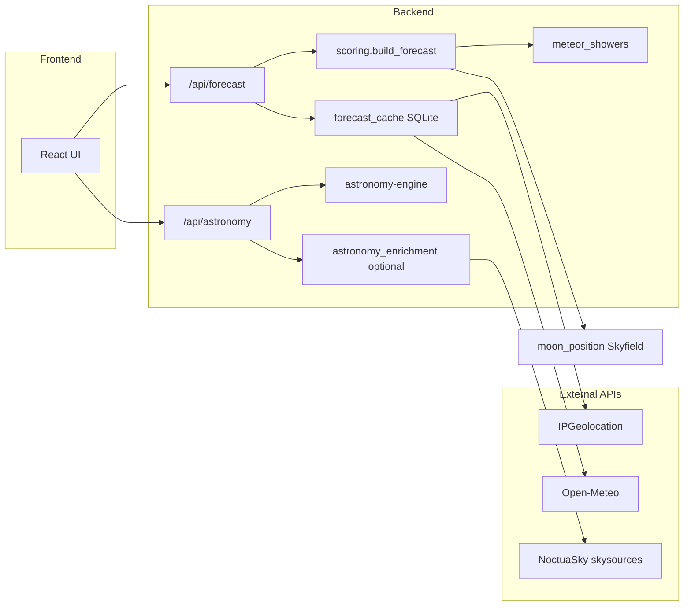

# Finderscope

A full-stack web app for stargazers. Enter an address to get a 7-day stargazing weather forecast, meteor shower peak highlights on matching nights, and a local astronomy summary (90-day events, planet visibility timelines) for your location.

## Application functionality

### Forecast search

1. The user enters a street address or place name.
2. The backend geocodes the location and fetches seven nights of astronomical darkness windows, moon data, and weather at hourly and 15-minutely resolution.
3. The UI displays one **night card** per evening, each with an overall stargazing score, rating, moon details, cloud/precipitation summaries, suggested best hours, and **meteor shower peak badges** when a major shower peaks that night and its radiant is observable during astronomical darkness at the location.
4. Selecting a night opens a **scores panel** with half-hour (or hourly) bars during darkness, weather metrics, a dew point curve, and per-interval moon sky glow and altitude rows.

The scores panel uses a **unified left-aligned grid**: each row pairs a sticky label column with a data column so time labels, score bars, dew/air temperature lines, and metric values stay vertically aligned. Score values appear at the bottom of each bar; the dew point chart plots dew point and air temperature on a shared scale with padded Y-axis headroom. When `score_step_minutes` is `30`, columns are narrower and time labels are thinned to keep the panel readable.

### Stargazing score

Each score interval during astronomical darkness receives a score from 0–100 based on:

| Factor | Weight | Source |
|--------|--------|--------|
| Cloud cover | 40% | Open-Meteo (15-min preferred, hourly fallback) |
| Visibility | 25% | Open-Meteo (15-min preferred, hourly fallback) |
| Moon sky glow | 25% | IPGeolocation phase + Skyfield altitude |
| Precipitation / weather code | 10% | Open-Meteo (15-min preferred, hourly fallback) |

**Score step:** The API returns `score_step_minutes: 30` when half-hour slots are built. Each night’s darkness window can start at times like `21:30`; half-hour steps align scores with those boundaries instead of rounding to the next full hour.

| Resolution | Weather source | `:00` slots | `:30` slots |
|------------|----------------|-------------|-------------|
| Preferred | Open-Meteo `minutely_15` at `:00` / `:30` | Direct sample | Direct sample; precipitation sums two 15-min buckets |
| Fallback | Open-Meteo `hourly` | Hourly value | Linear interpolation of continuous fields; precipitation uses half the enclosing hour’s total |

The nightly card score is the average of interval scores during darkness. **Best hours** are contiguous windows where interval scores reach 70 or higher (may start or end at `:30`).

Moon impact uses two related concepts:

| Term | Meaning |
|------|---------|
| **Disk lit** | Lunar phase illumination — how much of the moon's disk is illuminated that night |
| **Avg moon sky glow** | Average effective sky brightness from moonlight during darkness; drives the nightly score |
| **Effective moon sky glow** (per interval) | Phase illumination scaled by moon altitude via `sin(altitude)`; low or below-horizon moons contribute less |

Moonrise and moonset on night cards are informational. Interval scores compute moon altitude with Skyfield at each slot’s midpoint (+15 minutes for 30-min steps). On first forecast run, Skyfield downloads a JPL ephemeris file (~16 MB) into `backend/data/ephemeris/`.

### Moon enrichment (FreeAstroAPI)

Night cards optionally show richer lunar display data and SVG phase graphics from [FreeAstroAPI](https://www.freeastroapi.com/moon). This is **UI-only enrichment** — forecast scores still use IPGeolocation disk illumination and Skyfield altitude.

| Step | Behavior |
|------|----------|
| Forecast search | Returns immediately with IPGeolocation moon text (0 FreeAstro calls) |
| Moon enrichment | Frontend calls `GET /api/moon/enrichment` after forecast loads |
| Cache hit | Phase name, age, special labels, and SVG served from server cache (0 live calls) |
| Cache miss | Backend queues fetches at **1 req/sec**; UI polls until graphics appear |
| Quota exhausted | Falls back to placeholder moon + IPGeolocation labels |

Free tier limits: **80 calls/day**, **1 request/second**. The server caches phase data globally by calendar date (shared across all users). A daily prewarm script fetches the next 7 dates (~7 calls/day) so most searches never hit the live API.

```bash
./scripts/prewarm-moon-cache.sh   # optional; requires FREEASTRO_API_KEY in backend/.env
```

### Astronomy summary (astronomy-engine)

After a forecast loads, the frontend calls `POST /api/astronomy` in parallel with moon enrichment. The backend uses [astronomy-engine](https://pypi.org/project/astronomy-engine/) locally — no API key required.

| Section | Window | Content |
|---------|--------|---------|
| **Events timeline** | Next 3 months | Lunar eclipses, local solar eclipses, Mercury/Venus transits, planetary oppositions/conjunctions, bright planet–planet conjunctions (≤ ~3° separation), and major meteor shower peaks (local IAU catalog + radiant/darkness checks) |
| **Planet visibility** | 7 forecast nights | For each calendar night date, whether Mercury–Neptune is above the horizon at any time that day |

Planet visibility rows include **sun-aware observing windows** when the planet is above the horizon and the Sun is below civil twilight (−6°) or astronomical twilight (−18°): `windows_civil[]` and `windows_astronomical[]` (local `HH:MM`), plus **peak altitude**, **peak time**, and **magnitude** at peak. Uranus and Neptune appear as muted telescope rows. The UI shows a **24-hour timeline** for the selected forecast night with lighter civil-twilight bars, solid astronomical bars, and a **forecast darkness overlay** clipped to that calendar day; a date dropdown switches among the seven forecast nights.

Events show a local visibility badge when they are global phenomena not guaranteed to be visible at the forecast location (e.g. transits, inferior/superior conjunctions with the Sun).

**Optional NoctuaSky enrichment** (`NOCTUA_ENRICHMENT_ENABLED=true`): after local event discovery, the server attaches catalog metadata (`subjects[]`: types, aliases, interest score) from [NoctuaSky](https://api.noctuasky.com/api/v1/swaggerdoc/) `skysources` for resolvable bodies. Enrichment is fail-open (events return without `subjects[]` on timeout). See `backend/docs/noctua_skysources.md`.

### Forecast response cache

`POST /api/forecast` caches upstream responses in SQLite (`backend/data/forecast_cache/`) when `FORECAST_CACHE_ENABLED=true` (default):

| Layer | Key | TTL (default) |
|-------|-----|---------------|
| Geocode | normalized address hash | 30 days |
| IPGeolocation astronomy time series | lat/lon (4 dp) + date range | 24 h |
| Open-Meteo weather | lat/lon (4 dp) + forecast start + days | 3 h |

Cached raw weather and astronomy payloads are re-scored on each request so scoring logic changes apply without invalidating weather data.

Night forecast cards show **meteor shower peak badges** when the catalog peak date matches a forecast night and the radiant is above the horizon during that night's astronomical darkness at the location.

### External services

| Service | Role | API key |
|---------|------|---------|
| [IPGeolocation.io](https://ipgeolocation.io) | Geocoding, twilight windows, moon phase/times | Required |
| [Open-Meteo](https://open-meteo.com) | Hourly, 15-minutely, and daily weather | None |
| [FreeAstroAPI](https://www.freeastroapi.com/moon) | Moon phase graphics and enriched lunar labels (optional) | Optional |
| [astronomy-engine](https://pypi.org/project/astronomy-engine/) | Local eclipse, conjunction, meteor shower, and planet visibility calculations | None (MIT library) |
| [NoctuaSky](https://api.noctuasky.com/api/v1/swaggerdoc/) | Optional catalog metadata enrichment for astronomy events | None (public skysources) |

API keys live in `backend/.env` only; the frontend never sees them.

## File architecture

```
finderscope/
├── backend/                    # FastAPI server
│   ├── app/
│   │   ├── main.py             # App entry, CORS, router registration, /health
│   │   ├── config.py           # Settings from environment (.env)
│   │   ├── models/
│   │   │   ├── forecast.py     # Pydantic schemas for forecast API
│   │   │   ├── moon_enrichment.py  # Pydantic schemas for moon enrichment API
│   │   │   └── astronomy.py    # Pydantic schemas for astronomy summary API
│   │   ├── routers/
│   │   │   ├── forecast.py     # POST /api/forecast orchestration
│   │   │   ├── moon_enrichment.py  # GET /api/moon/enrichment + SVG route
│   │   │   └── astronomy.py    # POST /api/astronomy
│   │   └── services/
│   │       ├── ipgeolocation.py    # Astronomy API client (geocode + time series)
│   │       ├── openmeteo.py        # Weather forecast client
│   │       ├── scoring.py          # Merge weather + astronomy into scores
│   │       ├── moon_position.py    # Skyfield moon altitude + sky-glow curve
│   │       ├── astronomy_events.py # 90-day eclipse/conjunction event search
│   │       ├── planet_visibility.py  # Sun-aware planet observing windows (civil / astronomical)
│   │       ├── astronomy_time.py   # Timezone/time helpers for astronomy-engine
│   │       ├── freeastroapi.py     # FreeAstro moon phase client
│   │       ├── moon_cache.py       # SQLite + SVG cache for moon enrichment
│   │       ├── moon_enrichment.py  # Enrichment orchestration
│   │       ├── moon_enrichment_queue.py  # 1 RPS rate-limited fetch queue
│   │       ├── forecast_cache.py   # SQLite cache for geocode / astronomy / weather
│   │       ├── meteor_showers.py   # IAU catalog + radiant visibility for forecast highlights
│   │       ├── noctua.py           # NoctuaSky skysources client
│   │       ├── noctua_cache.py     # Permanent skysource catalog cache
│   │       └── astronomy_enrichment.py  # Category-aware Noctua enrichment
│   ├── data/iau_meteor_showers.json  # Major shower peaks (local catalog)
│   ├── data/ephemeris/         # Cached JPL ephemeris (gitignored, auto-downloaded)
│   ├── data/forecast_cache/    # Forecast upstream cache (gitignored)
│   ├── data/moon_cache/        # Cached FreeAstro moon SVGs + quota state (gitignored)
│   ├── tests/
│   │   ├── test_scoring.py     # Scoring and forecast assembly tests
│   │   ├── test_moon_position.py
│   │   ├── test_astronomy_events.py
│   │   ├── test_planet_visibility.py
│   │   ├── test_astronomy_routes.py
│   │   ├── test_forecast_cache.py
│   │   ├── test_astronomy_enrichment.py
│   │   ├── test_meteor_showers.py
│   │   ├── test_routes.py      # Route tests with mocked services
│   │   ├── test_integration_live.py  # Opt-in live API tests
│   │   └── fixtures/           # JSON fixtures + E2E fixture generator
│   ├── requirements.txt
│   └── requirements-dev.txt
│
├── frontend/                   # React + Vite SPA
│   ├── src/
│   │   ├── App.tsx             # Main layout and state wiring
│   │   ├── main.tsx            # React entry point
│   │   ├── index.css           # Global styles
│   │   ├── components/
│   │   │   ├── AddressSearch.tsx
│   │   │   ├── NightForecastCard.tsx   # Daily night summary cards
│   │   │   ├── HourlyScoreChart.tsx    # Unified grid: scores, dew/temp, metrics
│   │   │   ├── hourly-chart-layout.ts  # Shared column width and temperature scale helpers
│   │   │   ├── AstronomyEventsPanel.tsx  # Events timeline + planet visibility timeline
│   │   │   ├── PlanetVisibilityTimeline.tsx  # 24h planet bars with darkness overlay
│   │   │   ├── CloudBreakdown.tsx
│   │   │   ├── PrecipitationBreakdownView.tsx
│   │   │   ├── DewPointChart.tsx
│   │   │   └── ErrorBanner.tsx
│   │   ├── hooks/
│   │   │   ├── useForecast.ts  # Forecast fetch state
│   │   │   ├── useMoonEnrichment.ts  # Async FreeAstro moon graphics
│   │   │   └── useAstronomySummary.ts  # Astronomy summary fetch state
│   │   ├── lib/
│   │   │   ├── backend-client.ts   # Typed fetch wrappers for /api
│   │   │   ├── astronomy-format.ts # Astronomy panel display formatters
│   │   │   ├── planet-timeline-layout.ts # 24h timeline segment helpers
│   │   │   ├── moon-sample-time.ts # Dark-window sample times for moon enrichment
│   │   │   └── weather-format.ts   # Display formatters
│   │   └── types/
│   │       ├── forecast.ts
│   │       ├── moon-enrichment.ts
│   │       └── astronomy.ts
│   └── vite.config.ts          # Dev server; proxies /api → localhost:8000
│
├── e2e/                        # Playwright browser tests
│   ├── tests/app.spec.ts
│   └── fixtures/               # Mocked API responses for offline E2E
│
├── scripts/
│   ├── check-integrity.sh      # Full test/lint/build harness
│   ├── prewarm-moon-cache.sh   # Daily FreeAstro cache prewarm (7 calls)
│   └── record-e2e-fixtures.sh  # Refresh E2E fixtures from live APIs
│
├── .github/workflows/ci.yml    # Runs check-integrity.sh on push/PR
├── .github/workflows/moon-prewarm.yml  # Scheduled moon cache prewarm
└── .cursor/skills/integrity-check/  # Agent skill for running checks
```

### Request flow



## Prerequisites

- Python 3.10+
- Node.js 18+
- Free API key from [IPGeolocation.io](https://ipgeolocation.io)
- Optional [FreeAstroAPI](https://www.freeastroapi.com/moon) key for moon phase SVG enrichment

Open-Meteo requires no API key.

## Setup

### Backend

```bash
cd backend
cp .env.example .env
# Fill in IPGEOLOCATION_API_KEY (see Prerequisites)

# Recommended: use a virtual environment
python3 -m venv .venv
source .venv/bin/activate   # Windows: .venv\Scripts\Activate.ps1

python -m pip install -r requirements.txt
uvicorn app.main:app --reload
```

On macOS, if `pip` is not found, use `python3 -m pip` instead of `pip`.

The API runs at `http://localhost:8000`.

### Environment variables

Copy `backend/.env.example` to `backend/.env`. Besides `IPGEOLOCATION_API_KEY`, optional settings include:

| Variable | Default | Purpose |
|----------|---------|---------|
| `FORECAST_CACHE_ENABLED` | `true` | SQLite cache for geocode, astronomy time series, and weather |
| `FORECAST_GEOCODE_TTL_HOURS` | `720` | Geocode cache TTL (~30 days) |
| `FORECAST_ASTRONOMY_TTL_HOURS` | `24` | IPGeolocation astronomy cache TTL |
| `FORECAST_WEATHER_TTL_HOURS` | `3` | Open-Meteo cache TTL |
| `NOCTUA_ENRICHMENT_ENABLED` | `false` | Attach NoctuaSky catalog metadata to astronomy events |
| `NOCTUA_BASE_URL` | NoctuaSky API v1 | Skysources client base URL |
| `FREEASTRO_API_KEY` | (empty) | Moon phase SVG enrichment (optional) |

### Frontend

```bash
cd frontend
npm install
npm run dev
```

The UI runs at `http://localhost:5173` and proxies `/api` requests to the backend.

## Development testing

### Backend

```bash
cd backend
pip install -r requirements-dev.txt   # or: python -m pip install -r requirements-dev.txt
python -m pytest
```

### Frontend

```bash
cd frontend
npm install
npm run test:run
npm run lint
```

### E2E (Playwright)

```bash
cd e2e
npm install
npm run test:install   # first time only
npm run test
```

E2E tests mock `/api/forecast`, `/api/astronomy`, and `/api/moon/enrichment` in the browser — no backend or external APIs required.

## Integrity checks

Run the full integrity harness from the repository root after code changes:

```bash
chmod +x scripts/check-integrity.sh   # first time only
./scripts/check-integrity.sh
```

Fast mode (skips the Vite production build):

```bash
./scripts/check-integrity.sh --fast
```

Live backend integration (~2 paid external API calls; requires valid `backend/.env`):

```bash
./scripts/check-integrity.sh --live
```

The harness runs, in order:

1. Skyfield ephemeris prefetch
2. Backend unit and route tests (`pytest`, excludes `live`)
3. Frontend unit tests (`vitest`)
4. E2E browser tests (`playwright`, mocked APIs)
5. Frontend lint (`oxlint`)
6. TypeScript compile (`tsc -b`)
7. Production build (`vite build`) — skipped with `--fast`
8. Live backend integration — only with `--live`

| Mode | External API calls |
|------|-------------------|
| Default | 0 |
| `--live` | ~2 paid (2 IPGeolocation; Open-Meteo and astronomy-engine are free/local) |

Refresh E2E fixtures from live responses when API shapes change (forecast via IPGeolocation; astronomy summary computed locally):

```bash
chmod +x scripts/record-e2e-fixtures.sh
./scripts/record-e2e-fixtures.sh
```

Regenerate mocked E2E fixtures from backend scoring fixtures (no API calls). The generator uses an Aug 2026 forecast week so the Perseids peak (Aug 12) appears on a night card in E2E:

```bash
cd backend
PYTHONPATH=. python3 tests/fixtures/generate_e2e_responses.py
```

Local-only Playwright screenshot tooling for meteor card previews (if present) is listed in `.gitignore` and is not part of CI.

A project Cursor skill at `.cursor/skills/integrity-check/` instructs the agent to run these checks before completing coding tasks.

## Continuous integration

GitHub Actions runs `./scripts/check-integrity.sh` on every push and pull request to `main`.
Live API tests are not run in CI.

## API reference

| Endpoint | Description | External calls |
|----------|-------------|----------------|
| `GET /health` | Health check | 0 |
| `POST /api/forecast` | 7-day stargazing forecast for an address | 2 IPGeolocation + 1 Open-Meteo on miss; 0 paid on geocode/astronomy cache hit |
| `GET /api/moon/enrichment` | Cached FreeAstro moon phase labels and SVG URLs | 0 when cached; 1/date on miss (queued at 1 RPS) |
| `GET /api/moon/visual/{date}.svg` | Cached moon phase SVG | 0 |
| `POST /api/astronomy` | 90-day event timeline + 7-night planet visibility | 0 local; optional Noctua skysources when enrichment enabled |

### Astronomy response fields

| Field | Description |
|-------|-------------|
| `events[]` | Upcoming events sorted by `start_at`; categories include `lunar_eclipse`, `solar_eclipse`, `transit`, `conjunction`, `opposition`, `meteor_shower` |
| `events[].visible_locally` | Whether the event is expected to be observable at the request coordinates |
| `events[].subjects[]` | Optional NoctuaSky catalog metadata (types, aliases, interest) when enrichment is enabled |
| `planet_visibility[]` | One entry per requested forecast night date |
| `planet_visibility[].planets[].windows_civil[]` | Planet above horizon while Sun altitude &lt; −6° (local `HH:MM`) |
| `planet_visibility[].planets[].windows_astronomical[]` | Planet above horizon while Sun altitude &lt; −18° (local `HH:MM`) |
| `planet_visibility[].planets[].visible` | `true` when at least one civil-twilight window exists |

### Forecast response fields

| Field | Description |
|-------|-------------|
| `score_step_minutes` | `30` when scores use half-hour slots; `60` when only hourly weather is available |
| `nights[].hourly` | Time-series score intervals during darkness (includes `:30` times when step is 30) |
| `prior_day_dark_window` | Previous calendar day's astronomical darkness (`night_begin`/`night_end`) for first-night pre-dawn spillover in the planet timeline |
| `nights[].moon_sky_glow_avg` | Average effective moon sky glow during darkness |
| `nights[].best_hours` | Contiguous high-score windows; may start or end at `:30` |
| `nights[].meteor_showers[]` | Meteor shower peak badges for that calendar night (`id`, `name`, optional `zhr_nominal`) |
