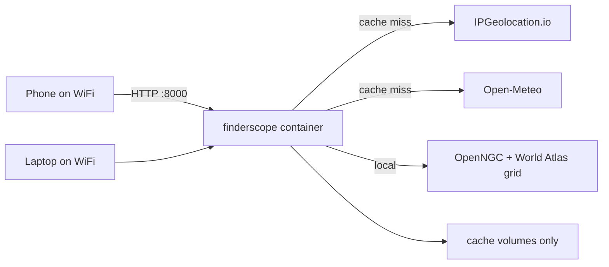

# LAN-only private deployment

Run Finderscope on a **home computer** for **private, non-commercial** use. Devices on your local network (or the host itself) open the app over HTTP — no public domain, HTTPS, or router port forwarding.

For VPS, cloud, or public HTTPS deployment, see [DEPLOYMENT.md](DEPLOYMENT.md).

Current release image: **v1.1.0** — `ghcr.io/jlaw3855/finderscope-app:1.1.0`

## Architecture



| Capability | Runtime dependency |
|------------|-------------------|
| 7-night forecast | IPGeolocation.io + Open-Meteo (+ optional 7timer) |
| Astronomy + planets | Local astronomy-engine |
| Deep sky visibility | Bundled OpenNGC + World Atlas grid (**no external API**) |
| Meteor shower badges | Bundled IAU catalog |
| Moon SVG enrichment | Optional FreeAstro key (disabled in minimal setup) |
| APOD | NASA key (optional; defaults to `DEMO_KEY`) |

**World Atlas licensing:** Light pollution data is [CC BY-NC 4.0](https://doi.org/10.5880/GFZ.1.4.2016.001). Private hobby use is in scope; do not use for commercial or ad-supported public hosting.

## Prerequisites

| Item | Notes |
|------|--------|
| **Computer** | macOS, Linux, or Windows with Docker Desktop + Compose v2 |
| **IPGeolocation API key** | **Required** — [ipgeolocation.io](https://ipgeolocation.io); plan must include geocoding + Astronomy API |
| **NASA API key** | Optional — [api.nasa.gov](https://api.nasa.gov/) for APOD rate limits |
| **RAM** | 4 GB+ host RAM; ~50 MB extra when DSO grid loads per worker |
| **Disk** | ~500 MB for image + cache volumes |

**Not needed:** domain, Caddy, port forwarding, DDNS, TLS certificates.

## Quick start (any machine)

From the repository root:

```bash
chmod +x scripts/deploy-lan.sh   # first time only
./scripts/deploy-lan.sh
```

Or manually from `deploy/lan/`:

```bash
cd deploy/lan
cp .env.example .env
# Edit .env — set IPGEOLOCATION_API_KEY and CORS_ORIGINS (see below)
docker compose pull
docker compose up -d
curl -s http://127.0.0.1:8000/health
```

Open **http://localhost:8000** on the host, or **http://\<host-lan-ip\>:8000** from other devices on the same Wi‑Fi.

Templates live in [`deploy/lan/`](../deploy/lan/):

- [`docker-compose.yml`](../deploy/lan/docker-compose.yml) — pulls GHCR image, cache-only volumes
- [`.env.example`](../deploy/lan/.env.example) — LAN-oriented defaults (no secrets)
- [`README.md`](../deploy/lan/README.md) — short pointer to this guide

## Environment variables

Create `deploy/lan/.env` from [`.env.example`](../deploy/lan/.env.example):

| Variable | LAN value |
|----------|-----------|
| `IPGEOLOCATION_API_KEY` | Your key (**required**) |
| `CORS_ORIGINS` | Must match the browser URL **exactly** (see CORS below) |
| `FORECAST_CACHE_ENABLED` | `true` (recommended) |
| `MOON_ENRICHMENT_ENABLED` | `false` for minimal setup |
| `NOCTUA_ENRICHMENT_ENABLED` | `false` |
| `NASA_API_KEY` | Optional personal key |

Full list: [`backend/.env.example`](../backend/.env.example).

### CORS on LAN

`CORS_ORIGINS` must match how you open the app:

| Use case | Example |
|----------|---------|
| Host only | `http://localhost:8000` |
| Phone/tablet on Wi‑Fi | `http://192.168.1.100:8000` (replace with host LAN IP) |
| Both | `http://localhost:8000,http://192.168.1.100:8000` |

After changing `.env`, restart: `docker compose up -d`.

Find the host LAN IP:

- **macOS:** System Settings → Network, or `ipconfig getifaddr en0`
- **Linux:** `ip -4 addr` or `hostname -I`
- **Windows:** `ipconfig`

Consider a **DHCP reservation** on your router so the IP does not change.

## Persistent storage

The compose file mounts **cache subdirectories only**:

| Volume | Contents |
|--------|----------|
| `finderscope-forecast-cache` | Geocode, astronomy, weather, 7timer SQLite caches |
| `finderscope-moon-cache` | Moon SVG cache (if enrichment enabled) |
| `finderscope-noctua-cache` | Noctua metadata (if enrichment enabled) |

**Do not** mount a single empty volume at `/app/data` — that hides bundled OpenNGC, World Atlas grid, and meteor catalog from the image. See [DEPLOYMENT.md § Persistent storage](DEPLOYMENT.md#persistent-storage).

Caches survive container restarts and reboots. They are **per machine** — copying `deploy/lan/` to another PC does not copy caches unless you back up the Docker volumes.

## Access from other devices

1. Note the host LAN IP (e.g. `192.168.1.100`).
2. Add `http://192.168.1.100:8000` to `CORS_ORIGINS` in `.env`.
3. `docker compose up -d`
4. On phone/tablet (same Wi‑Fi), open `http://192.168.1.100:8000`
5. If connection fails, allow inbound TCP **8000** on the host firewall for the LAN profile.

## Verification

On the host:

1. `curl http://127.0.0.1:8000/health` → `{"status":"ok","version":"1.1.0"}`
2. Search `Denver, CO` — forecast cards appear
3. Open **Astronomy** → **Deep sky visibility** loads
4. Site-sky chip shows real Bortle/SQM (`world_atlas_2015`, not fallback Bortle 5)
5. Search the same city again — faster (forecast cache hit)

From another LAN device: repeat steps 2–4 at `http://<host-ip>:8000`.

## When the machine shuts down

- The app is **offline** until the machine is on and `docker compose up -d` has run (or Docker restarts the container via `restart: unless-stopped`).
- **Caches and `.env` persist** on disk across reboots.
- **Bundled data** stays in the image; no re-download needed.
- If DHCP assigns a new LAN IP, update `CORS_ORIGINS` and use the new URL.

Enable Docker to start at login/boot and disable sleep on the host if you want the app available whenever the machine is powered.

## Updates

When a new release is published on [GitHub Releases](https://github.com/jlaw3855/finderscope-app/releases):

```bash
cd deploy/lan
# Optionally pin image tag in docker-compose.yml to the new version
docker compose pull
docker compose up -d
```

## Ongoing operations

| Task | Command / note |
|------|----------------|
| Logs | `docker compose logs -f finderscope` |
| Stop | `docker compose down` |
| Stop and remove caches | `docker compose down -v` (deletes SQLite caches) |
| API usage | Keep `FORECAST_CACHE_ENABLED=true`; household traffic usually fits free tiers |

## Expected cost

| Item | Cost |
|------|------|
| Domain / HTTPS | $0 (not used) |
| IPGeolocation.io | $0 on free tier for household use |
| Open-Meteo, 7timer, DSO grid | $0 |
| NASA APOD | $0 with personal key |
| Electricity | Negligible if the machine runs anyway |

## Deploying on multiple machines

Each machine gets its own copy of `deploy/lan/`:

1. Clone or copy `deploy/lan/` to the machine.
2. Create `.env` from `.env.example` with that machine’s `CORS_ORIGINS` (LAN IP may differ).
3. `docker compose pull && docker compose up -d`

Secrets and caches are **not** shared between machines unless you copy `.env` and back up Docker volumes manually.

## Out of scope

- Public internet exposure (see [DEPLOYMENT.md](DEPLOYMENT.md))
- HTTPS / reverse proxy on LAN (HTTP is typical for private home use)
- Login, rate limiting, or multi-tenant access
- Tailscale / VPN remote access (optional future addition)

## Related docs

- [DEPLOYMENT.md](DEPLOYMENT.md) — GHCR, VPS, HTTPS, public hosting
- [README.md](../README.md) — development setup and API reference
